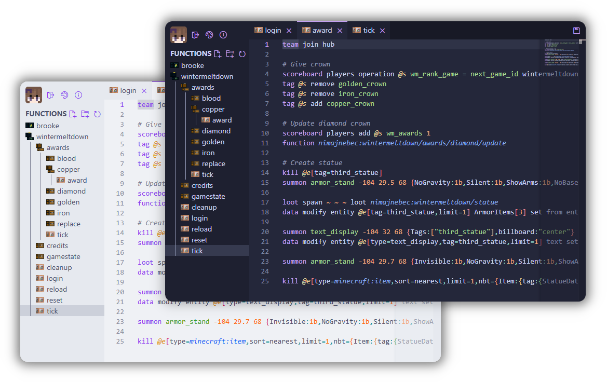

# mcfunction-server

mcfunction-server is a browser IDE based on [Visual Studio Code](https://github.com/microsoft/vscode) for editing mcfunction files on your server in real time. It features player-based authentication and function hot-reloading!

## Getting Started

Simply drop the [latest release](https://github.com/brooke-ec/mcfunction-server/releases/latest) into your fabric mods folder and use the `/editor` command in-game to log in!

For a more advanced setup, be sure to check the mod's configuration file.
